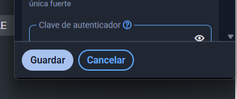

# **Guia d'Ús Tècnica Bitwarden**

El primer que farem serà accedir a la **pàgina oficial de Bitwarden**. Un cop hi siguem, anirem a l’apartat d’**extensions** i seleccionarem la que correspongui al nostre **navegador web** (com ara Chrome, Firefox o Edge). Finalment, farem clic a **“Afegir al navegador”** per instal·lar l’extensió i començar a utilitzar-la.

Després, tornarem a entrar a la pàgina de **Bitwarden**, on ens mostraran els passos per **configurar l’extensió** i assegurar-nos que **funcioni correctament** al nostre navegador.

El següent pas serà obrir l’**extensió de Bitwarden** i fer clic a **“Crear compte”** per iniciar el procés de registre i configurar el nostre usuari.  

A continuació, haurem d’introduir el nostre **correu electrònic**, i ens enviaran un **missatge de confirmació** per verificar el compte. Un cop confirmat, ja podrem accedir a Bitwarden amb les nostres credencials.  

Un cop completats tots els passos anteriors, haurem de **crear la nostra contrasenya mestra**, que serà la que utilitzarem per **accedir al nostre compte de Bitwarden**. Aquesta contrasenya ha de ser **segura i difícil d’endevinar**, per tal de garantir la millor protecció possible davant dels **ciberdelinqüents**. També podem afegir una **pista de recordatori** per si algun dia ens n’oblidem.  

I així és com es veu l’**aplicació d’escriptori** de Bitwarden, que a mi personalment em sembla **més còmoda i pràctica** d’utilitzar que l’extensió del navegador.  

Així és com es veu la **versió d’extensió del navegador**, que ens permet **accedir ràpidament a les nostres contrasenyes** sense necessitat d’obrir l’aplicació d’escriptori.  

Per **crear una nova contrasenya o compte** per protegir el nostre **Gmail** (o qualsevol altre servei), haurem de fer clic al botó **“+”** situat a la part inferior i, tot seguit, seleccionar l’opció **“Entrada”** per afegir les dades del nou compte.  

Quan ens aparegui aquesta finestra, hi posarem el **nom de la pàgina o aplicació** que volem desar, després l’**usuari** —que en el meu cas és el del **Gmail**— i, finalment, veurem **com crear la contrasenya** que hi anirà associada.  

Fem clic a l’**icona de generar contrasenya**, i a continuació podem ajustar la **longitud** de la contrasenya. També podem seleccionar si volem incloure **majúscules, minúscules, números i caràcters especials**, així com establir el **mínim de caràcters numèrics i especials** que ha de tenir.  

Després, si volem que l’extensió **ompli automàticament la contrasenya** quan accedim a la pàgina, hem d’introduir la **URL del lloc web** on es demana la contrasenya. Tot i això, també hi ha **altres maneres** de configurar-ho; ara mateix veurem aquesta opció.  

A continuació, entrem al **Gmail** i introduïm la nostra **contrasenya mestra** per accedir al compte a través de Bitwarden.  

Després, com veurem, ens apareix **directament el Gmail** que hem afegit. Si fem clic a **“Rellenar”**, l’extensió **omplirà automàticament la contrasenya** al camp corresponent, facilitant l’inici de sessió sense haver-la de recordar manualment.  

Ara us mostraré com fer-ho en una pàgina web diferent, com **Mastermind**. Primer, fem clic a **“Iniciar sesión”** i, a continuació, seleccionem **“Nuevo inicio de sesión”** per afegir un nou compte a Bitwarden.

Introduïm aquí l’**usuari** i la **contrasenya** del lloc web, i l’apartat de la **URL** s’omplirà **automàticament**, facilitant així la configuració del nou compte a Bitwarden.  

Finalment, fem clic a **“Guardar”** per desar el nou compte a Bitwarden i assegurar-nos que la informació queda registrada correctament per omplir-la automàticament en el futur.  

Ara, quan vulguem **iniciar sessió** en aquest lloc web, Bitwarden ens mostrarà **automàticament les credencials** guardades, permetent omplir-les amb un sol clic sense haver-les d’introduir manualment.  

Finalment, anirem a l’apartat per veure com **exportar les contrasenyes**, de manera que puguem **guardar-les com una còpia de seguretat** en un emmagatzematge xifrat. El primer que hem de fer és fer clic a **“Arxius”** per començar el procés.  

Després, fem clic a **“Exporta caja fuerte”**, és a dir, exportarem **totes les contrasenyes** que tenim guardades a Bitwarden per crear la còpia de seguretat.  

Aquí podem **seleccionar les dades** que volem exportar, i per garantir que la còpia estigui **xifrada**, seleccionem l’opció **“JSON Encrypted”** abans de guardar el fitxer. 

Aquí podem triar si volem que la còpia de seguretat sigui de **“Cuenta restringida”**, és a dir, que només es pugui obrir amb el nostre compte, o **“Protegit amb contrasenya”**, on nosaltres establim la contrasenya que protegirà l’arxiu exportat.  

Després, per **confirmar l’exportació**, hem d’introduir la nostra **clau mestra**, assegurant així que només nosaltres puguem generar la còpia de seguretat xifrada.  

Finalment, guardem l’arxiu on vulguem; tot i això, **és més segur desar-lo en un USB xifrat** per protegir la còpia de seguretat davant de possibles accesos no autoritzats.  

