# **T04: Serveis de Directori - LDAP**

Autor: *Christian Bogdanas*

---

## 1. Objecte de l’Encàrrec

Creem una màquina amb **Ubuntu Server**.

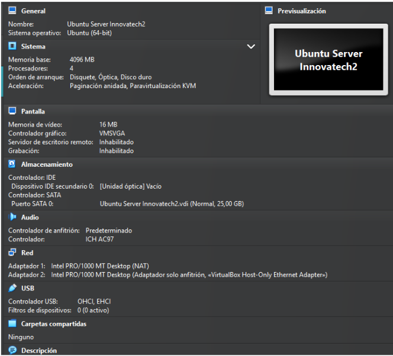

En entrar a la màquina, el primer que farem serà executar un `sudo apt update && sudo apt upgrade` per actualitzar els paquets i evitar possibles errors més endavant.

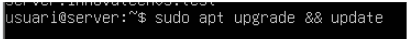

A continuació, editem el domini amb la comanda:

```
sudo nano /etc/hosts
```

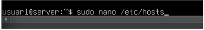

Configurem el fitxer com s’indica a continuació.

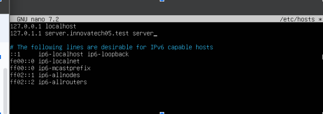

Comprovem que s’hagi actualitzat correctament:

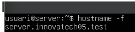  
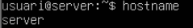

---

## 2. Requeriments d’Infraestructura Inicial

El pas següent és configurar la màquina virtual.  
Anirem a la configuració de xarxa i posarem el **primer adaptador en NAT** i el **segon en mode només amfitrió (Host-Only)**.

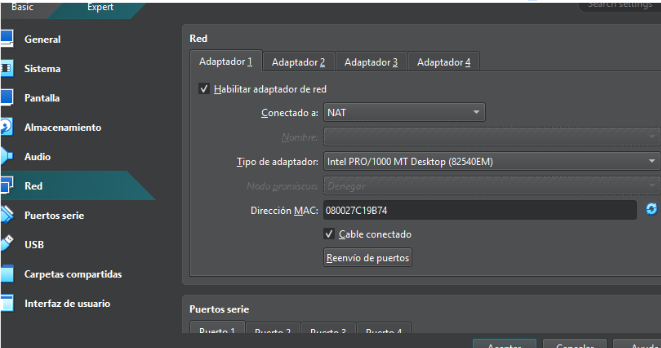  
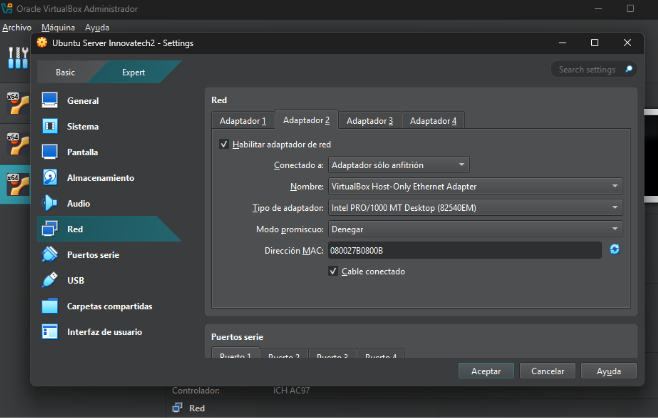

Després de configurar el mode Host-Only, editarem la interfície de xarxa amb:

```
sudo nano /etc/netplan/50-cloud-init.yaml
```

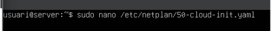

Afegirem la interfície `enp0s8` i l’opció `dhcp4: true`.

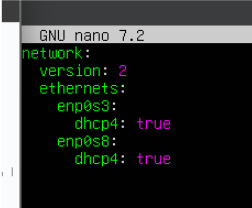

Desarem els canvis amb:

```
sudo netplan apply
```

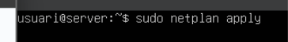

Finalment, comprovarem amb `ip a` que la configuració s’ha aplicat correctament.

---

## 3. Tasques d'Implementació i Configuració del Servidor LDAP

### 3.1. Instal·lació i Configuració Bàsica d’OpenLDAP

Instal·lem el servidor i les utilitats LDAP amb la comanda:

```
sudo apt install slapd ldap-utils -y
```

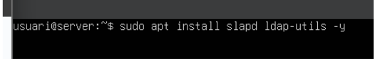

Durant la instal·lació, se’ns demanarà establir una contrasenya per a l’administrador. Seguint el plec de condicions, farem servir **p@ssw0rd**.

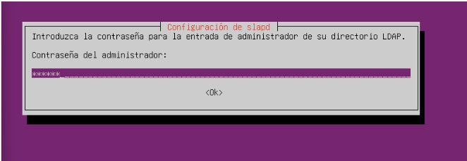

Comprovem que el servei està actiu:

```
systemctl status slapd
```

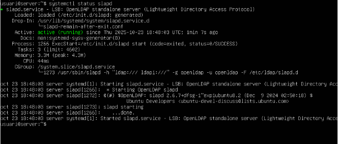

Podem visualitzar la configuració amb:

```
sudo slapcat
```

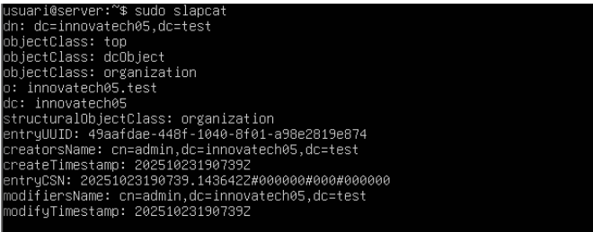

Si el directori no s’ha creat correctament, podem reconfigurar el servei amb:

```
sudo dpkg-reconfigure slapd
```

Crearem dues unitats organitzatives: **users** i **groups**. Per fer-ho, generem un fitxer `OU_users.ldif`.

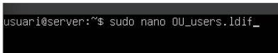

Editem el fitxer i afegim les OUs corresponents:

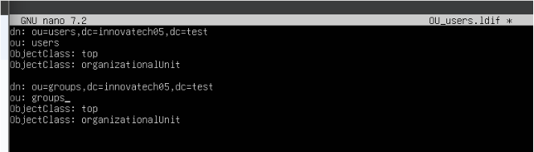

Afegim les noves OUs amb:

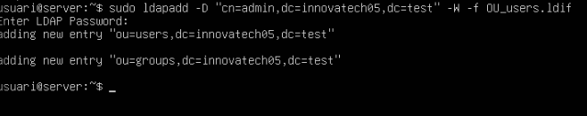

Comprovem que s’han creat correctament:

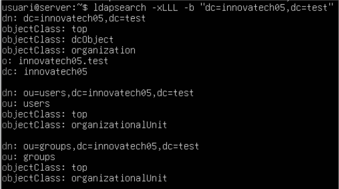

---

### 3.2. Gestió i Administració amb LAM

Per facilitar l’administració del servidor, farem servir **LDAP Account Manager (LAM)**.  
Primer, instal·lem el paquet necessari:

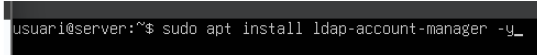

Obtenim la IP del servidor amb `ip a` per poder accedir-hi des del navegador:

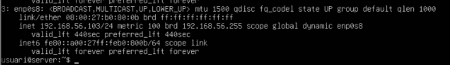

Accedim a la pàgina del LAM escrivint a l’adreça del navegador:

```
http://<ip_del_servidor>/lam
```

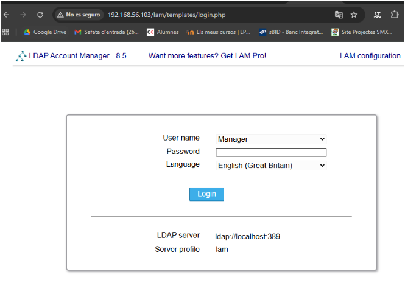

Entrem a **LAM Configuration** → **Edit Server Profiles**.

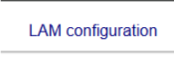

La contrasenya per defecte és `lam`.

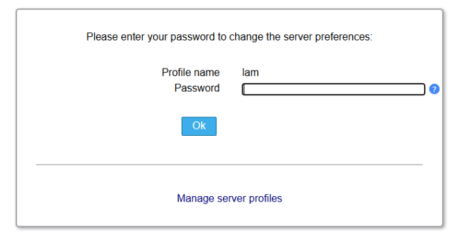

Configurem l’idioma, el compte d’administrador i altres paràmetres generals.

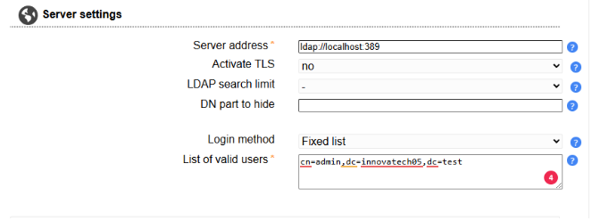  
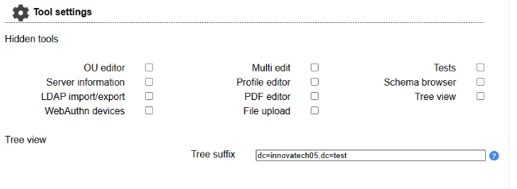

Definim els **Domain Names (DN)** per als usuaris i grups amb les seves respectives OUs.

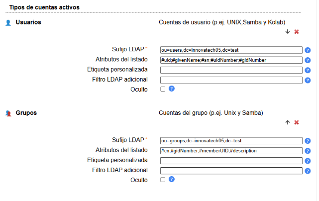

Guardem els canvis.

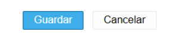

Ara ja podem iniciar sessió com a administrador (`admin`) amb la contrasenya `p@ssw0rd`.

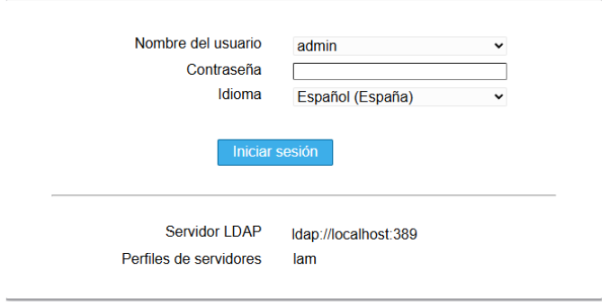

Per crear grups, accedim a **Comptes → Grups**, i creem dos grups: `tech` i `manager`.

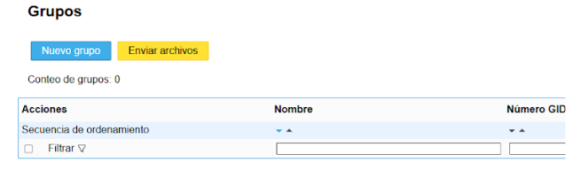  
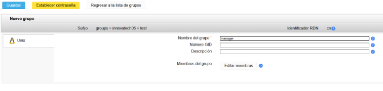

Podem veure el missatge de confirmació de creació del grup.

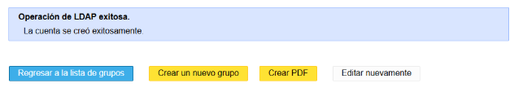

Per crear usuaris, anem a **Comptes → Usuaris** i creem `tech01` i `manager01`.

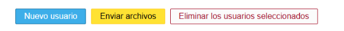  
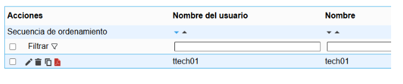

Assignem a cada usuari el seu grup principal i grups addicionals segons correspongui.

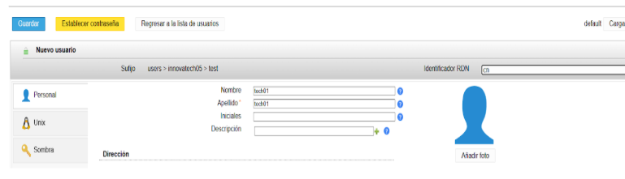  
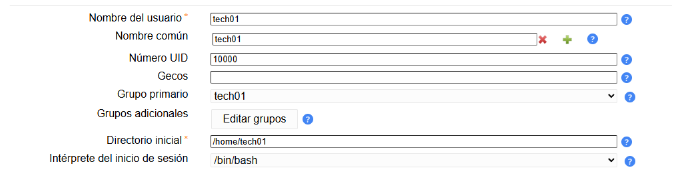

I li posarem el grup tech en els grups addicionals, el que vam crear.

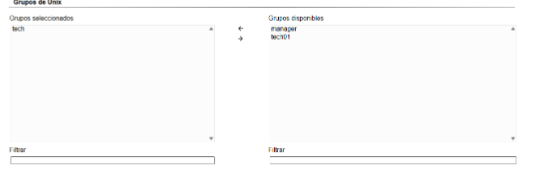 

Creem la contrasenya per a l’usuari (`1234`) i la desem.

 
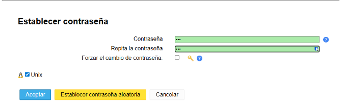

I guardem.

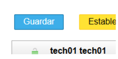  

Repetim el procés amb `manager01`.


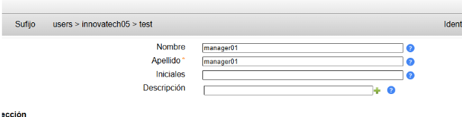  
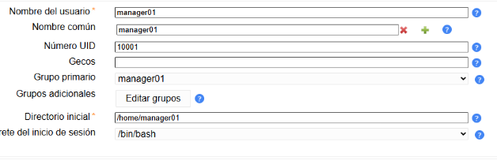  
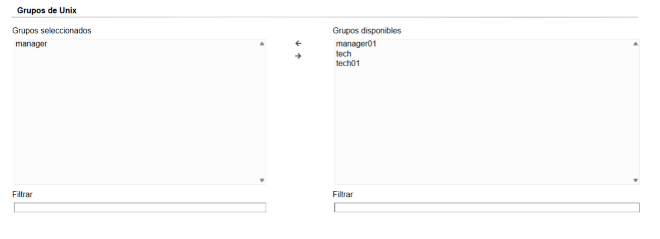
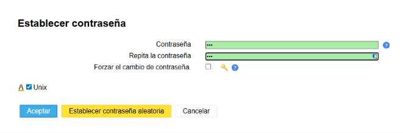

---

## 4. Integració del Client (Ubuntu Desktop)

Comprovarem que el servidor LDAP funciona correctament configurant un client **Zorin OS** amb les següents característiques:

El primer adaptador serà **NAT** i el segon **Host-Only**.

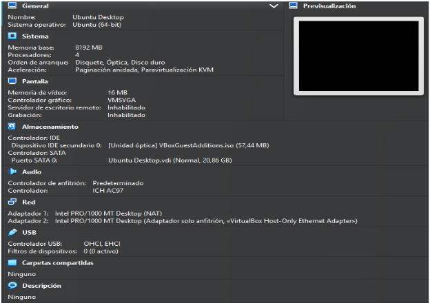
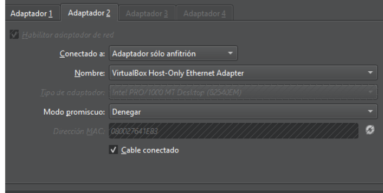 

Configurem la interfície de xarxa:

```
sudo nano /etc/netplan/50-cloud-init.yaml
```
 
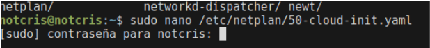
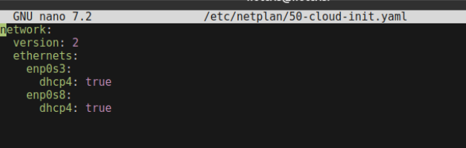

Desem amb:

```
sudo netplan apply
```
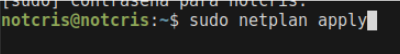  


Editem el fitxer `/etc/hosts` per configurar el nom del equip perque formi part del mateix domini que el servidor.


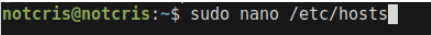

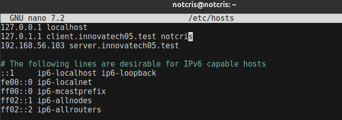

Comprovem que el nom del dispositiu s’ha actualitzat correctament.

 

Creem una instantània de la màquina per seguretat.

 


Verifiquem la resolució DNS amb:

```
dig server.innovatech05.test
```


Fem una consulta LDAP des del client per comprovar la connectivitat:

```
ldapsearch -x
```
  


Instal·lem els mòduls necessaris per integrar el client al domini:


  
  
  
  
  
  

  

Editem `nsswitch.conf` per permetre la gestió d’usuaris i grups via LDAP:


Modifiquem `common-password` eliminant la línia `use_authok`:

  

  

Editarem `common-session` i afegirem la línia següent per crear automàticament els perfils d’usuari:

```
session optional pam_mkhomedir.so skel=/etc/skel umask=077
```


Reiniciem el servei:


Comprovem que el sistema detecta correctament els usuaris LDAP:

 

Per permetre l’inici de sessió gràfica dels usuaris de domini, editem el fitxer corresponent:

 

  

Reiniciem la màquina, seleccionem “No està a la llista” i iniciem sessió amb un dels usuaris.


  

  
  


Un cop dins, comprovem amb la comanda `id` que tot s’ha creat correctament.


Repetim el procés amb l’altre usuari.


