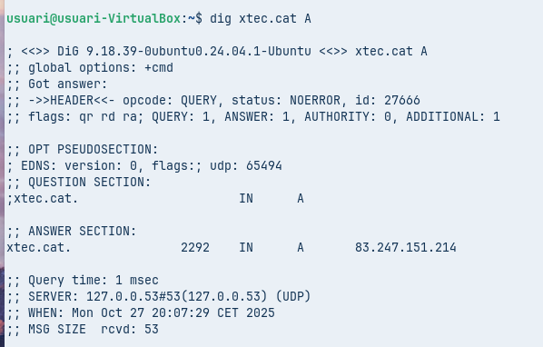
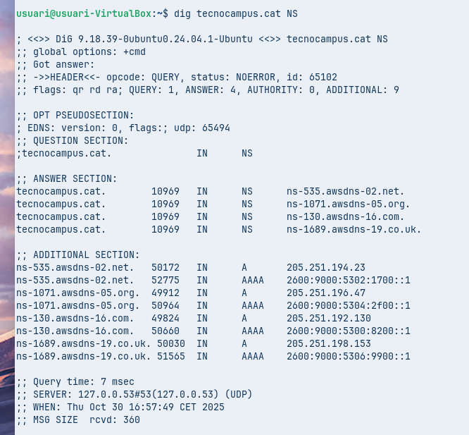
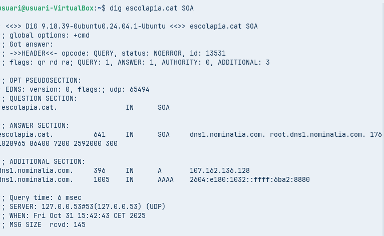
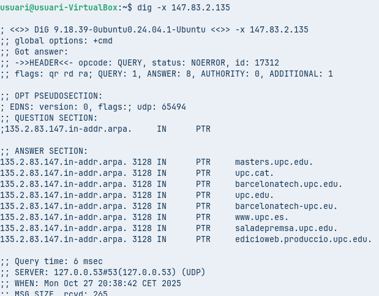
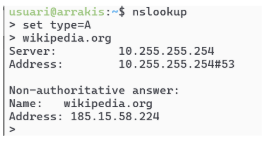
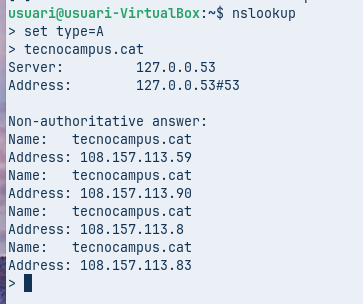
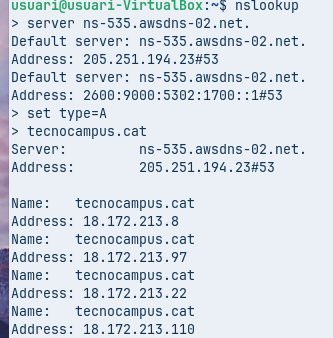

**A**. **Diagnosi Avançada amb dig (Linux / macOS)**

* **Comanda 1: Consulta Bàsica de Registre A**  
  * Executa dig xtec.cat A

* Anàlisi: Identifica la IP de resposta, el valor TTL i el servidor que ha respost a la consulta.

Com podem veure, el valor **TTL és 2292 segons**, tot i que aquest valor pot anar variant, ja que indica **el temps que la resposta es manté emmagatzemada a la memòria cau** abans de tornar a fer la consulta.  
L’**adreça IP de resposta** és **83.247.151.214**, i el **servidor que ha respost la consulta** és **127.0.0.53**, que correspon al **servidor DNS local del sistema**.

* **Comanda 2: Consulta de Servidors de Noms (NS)**  
  * Executa dig tecnocampus.cat NS

* Anàlisi: Quins són els servidors de noms autoritatius per a aquest domini?

 Són els que apareixen a la secció **ANSWER SECTION.** 

* **Comanda 3: Consulta Detallada SOA**  
  * Executa dig escolapia.cat SOA

* Anàlisi: Quina és la informació del correu de l'administrador i el número de sèrie del domini?

El **correu de l’administrador** és **root.dns1.nominalia.com.** i el **número de sèrie** que apareix tot seguit és **1762028965**.

Aquestes dades formen part del **registre SOA (Start of Authority)**, que indica quin és el servidor principal del domini i qui n’és el responsable administratiu.

* **Comanda 4: Consulta resolució inversa**  
  * Executa comanda dig \-x 147.83.2.135

* Anàlisi: Quina informació sobre els registres s’obté?

Podem veure **tots els noms de domini associats amb aquella adreça IP**.  
 El **registre PTR** s’utilitza per **esbrinar quin nom de domini està vinculat a una IP** (és a dir, per fer una resolució inversa).  
 També es pot observar el **valor TTL**, que indica el temps que la informació es manté a la memòria cau, i finalment el **servidor que ha respost la consulta**, que és **127.0.0.53**.

**Comprovació de Resolució amb nslookup (Multiplataforma)**

L’eina nslookup es troba a pràcticament a qualsevol sistema operatiu. Es pot usar de forma similar a dig incloent l’argument o si s’executa nslookup sense arguments, entrar en el mode interactiu, us apareix un prompt (\>). Serà aquest mode el que explorareu . 

El mode és força senzill, bàsicament hi ha tres comandes a usar:

* **set type=** per indicar el tipus de consulta: A, AAA, MX, NS, SOA, TXT o ALL.  
* **server** **IP** on IP és la IP del servidor de noms al que es vol fer la consulta, també es pot indicar el nom del servidor enlloc de la IP, per exemple, server a9-66.akam.net.  
* **exit** que serveix per sortir de la comanda.  
* **Comanda 1: Consulta Bàsica no Autoritativa**  
  * Seleccionar *type=A* i com a domini de consulta [tecnocampus.cat](http://tecnocampus.cat)

* Anàlisi: Per què indica que la resposta és no autoritativa?

Perquè **el servidor que respon no és l’origen de la informació DNS**, sinó **un intermediari** que **ha desat la informació del servidor autoritatiu a la seva memòria cau** per poder respondre més ràpidament a futures consultes.

* **Comanda 2: Consultes autoritatives**  
  * Escriure *server IP* i escriure la IP del primer servidor de noms del domini tecnocampus.cat que s’ha obtingut d’una consulta anterior. A continuació, indiqueu que voleu consultar registres de tipus A i del domini [tecnocampus.cat](http://tecnocampus.cat)

* Anàlisi: Quines diferències s’observen a la resposta obtinguda amb la comanda 1?

Aquesta és **una consulta autoritativa**, i per això **no apareix el missatge “Non-authoritative answer”**.  
Això passa perquè, amb la comanda, **hem consultat directament un dels servidors que gestionen oficialment el domini** `tecnocampus.cat`, és a dir, **un servidor DNS autoritatiu** que conté la informació original del domini.

- [Tornar al enunciat](README.md)

